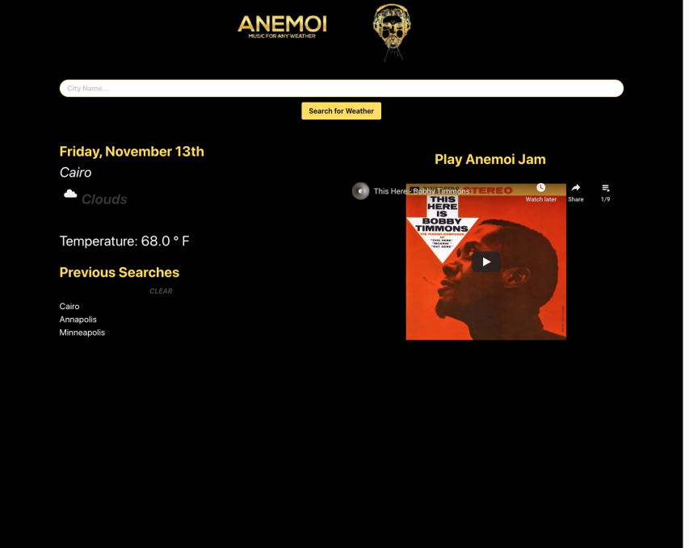

# Anemoi

## Overview

An app for a weather and music enthusiast that generates the current weather and a music video playlist based on current
weather data.

## User's Needs/Expectations

The user, a weather and music enthusiast, wants to hear a playlist based on the current weather input, so that they can
feel the weather on a deeper level.

- The current weather application must allow the user to search for the weather outlook for multiple cities, by their
  name.
- The music video playlist must load on search of a city's current weather and present a playlist of music videos based
  on that city's weather.
- The app will run in the browser and feature dynamically updated HTML and CSS powered by JQuery.
- OpenWeather API is used to retrieve weather data for cities and YouTube API is employed to generate music playlists.

## Exepctations Obtained from Research on Weather and Music Enthusiasts

Through information and feedback provided through research of weather and music enthusiast, the following criteria were
established:

- The weather and music enthusiast is using Anemoi to find the current weather and receive a music video playlist of
  music based on the current weather.
- When the user opens the app :
  - There are is a form input to search for a city.
    - When the user searches for a city:
    - They are presented with current weather conditions and that city is added to the search history.
      - When they view current weather conditions for that city
      - Then they are presented with the city name, the date, and icon representation of weather conditions, and the
        temperature.
      - When the the user enters the name of a city to view the current weather conditions.
      - Then they are presented with a music video player that has a music video playlist of music based on the current
        weather conditions.
- When the user clicks on a city in the search history
- Then they are again presented with current weather conditions and a music video playlist.
- When the users opens the Anemoi app
- Then they are presented with the last searched city

## Overall Deployment of Anemoi

- The \$(document).ready(function) is employed so the the JQuery events and AJAX calls won't fire until their designated
  times.
- On load of page: a search input and search button are present to enter a city name in order to obtain its current
  weather condition.
- Also on load of page, if there isn't a search history of cities, an open array will begin.
- When the user inputs the city name into the text box and clicks the search button, event listeners and functions are
  triggered for:

  - The city name inputed into the text box or clicked saved city to be saved to local storage and be rendered with as
    clickable text.
  - A first AJAX call is made to Current Weather Data API to obtain the current weather condition of the city.
  - The last AJAX call is made to YouTube API using the current weather condition term from the first call to obtain a
    music playlist.
  - JQuery is used to render in a card and append divs to contain the current day's weather.
  - The dt from the AJAX call is passed through moment.unix().format(M/DD/YYY) to format the date.
  - The weatherIcon variable is created from the AJAX call for the weather information.
  - The iconURL variable is created from OpenWeather's URL for icon images ("https://openweathermap.org/img/wn/") + the
    weather icon data from the AJAX call ("weatherICON) + ".png" for the image format.
  - The current temperature is obtained.

- JQuery is used to render in a div that holds the iframe music player.
- Math.floor(Math.random()) are used with the repose from the OpenWeather API passed to the YouTube API to create a
  randomized playlist.
- The YouTube API takes the current weather condition and uses that word as a search term.
- When the user refreshes the application, the saved city(cities) persist as clickable text(s) and the last searched
  city's current weather information is presented, due to the retrieval of data from local storage and subtracting one
  from the retrieved array.
  - Since the users's searched city(cities) will be generated from an input, JSON.parse and JSON.strigify are used to
    set and retrieve the searched city(cities) from the client side local storage.

## Deployed Website and JQuery Code with AJAX calls

\*[Deployed website](https://nobleburgundy.github.io/weather-jamz/) \*[GitHub Repository](https://github.com/nobleburgundy/weather-jamz)

## Research Resources

- [OpenWeather - Current weather data](https://openweathermap.org/current)
- [YouTube - Data API](https://developers.google.com/youtube/v3)
- [Bulma](https://bulma.io/)
